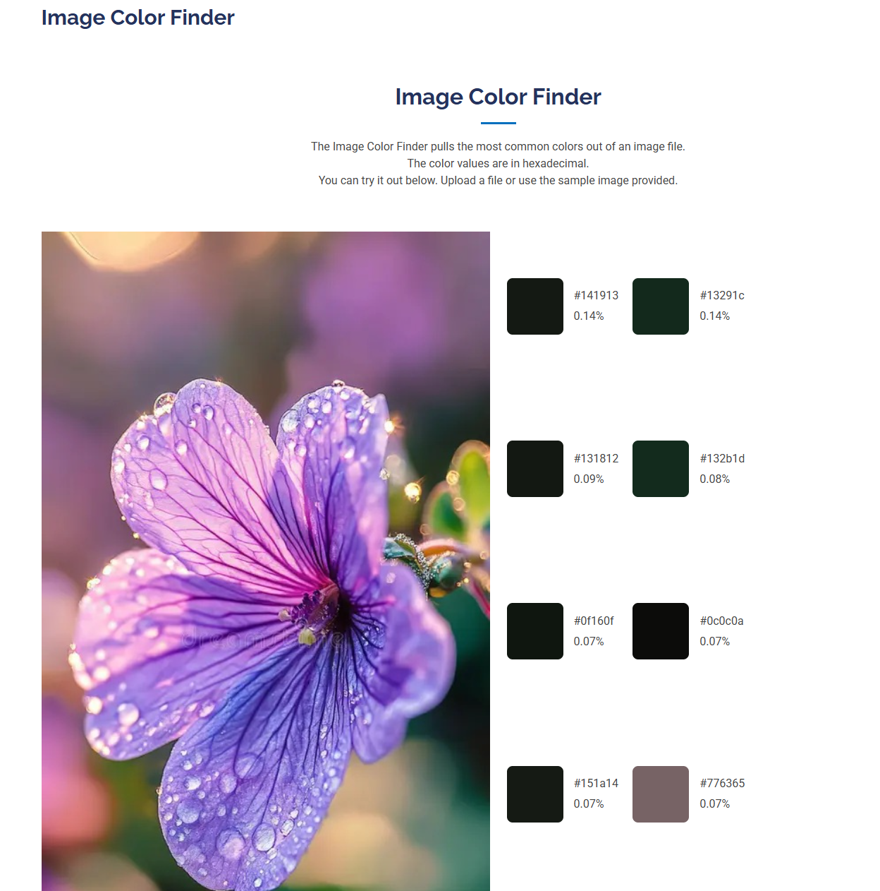

# Image Color Finder 🎨

A simple web application that extracts the **10 most common colors** from an uploaded image and displays their HEX values and percentage of the image.

The project was inspired by [Flat UI Colors](https://flatuicolors.com/palette/defo) and built as part of my Python learning journey.

## 📸 Screenshot

## ✨ Features

* Upload an image directly from the browser
* Extract the 10 most common colors from the image
* Convert RGB color values to HEX
* Display the percentage of each color in the image
* Display the uploaded image
* Includes a sample image to demonstrate the application
* Basic validation to prevent submitting the form without an image

## 🛠️ Technologies Used

* **Python**
* **Flask**
* **Pillow (PIL)**
* **HTML**
* **CSS**
* **Jinja2**
* **Bootstrap**

## ⚙️ How It Works

1. The user uploads an image through the web interface.
2. Flask receives and saves the uploaded image.
3. Pillow processes the image and extracts its colors.
4. The colors are sorted by how frequently they appear.
5. The 10 most common colors are selected.
6. RGB values are converted to HEX codes.
7. The percentage of each color is calculated based on the total number of pixels.
8. The results are displayed alongside the uploaded image.

## 📚 What I Learned

This project helped me practice:

* Working with images using Pillow
* Using `Image.getcolors()` to analyze image data
* Sorting and processing lists of color values
* Converting RGB values to HEX
* Calculating percentages based on pixel counts
* Handling file uploads with Flask
* Passing data from Flask to Jinja templates
* Using Jinja loops to dynamically generate HTML
* Working with static files in Flask
* Structuring a Flask application into separate functions and routes

## 🔮 Possible Improvements

Some ideas for future improvements:

* Add a drag-and-drop upload area
* Allow users to copy HEX values with one click
* Improve the color extraction algorithm by grouping similar colors
* Add support for more than 10 colors
* Add a download option for the generated color palette

